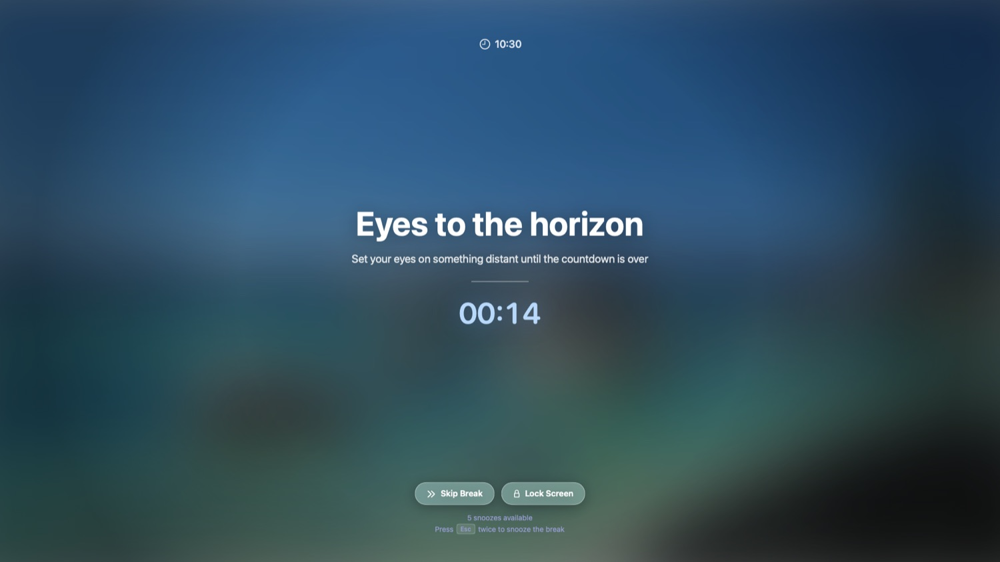

# LookAround

A native macOS menu-bar break-reminder app built with SwiftUI.
No Xcode required: it compiles with the Command Line Tools alone.



🌐 **Website:** https://henryle97.github.io/look-around/

## Install

**Homebrew**

```sh
brew install --cask henryle97/tap/lookaround
```

**Direct download** — grab the latest `LookAround-*.dmg` from
[GitHub Releases](https://github.com/henryle97/look-around/releases/latest),
open it, and drag LookAround into Applications.

> LookAround is distributed without an Apple Developer certificate (no
> signing, ever — see [packaging/homebrew/README.md](packaging/homebrew/README.md)).
> On first launch macOS may block it — approve it under System Settings →
> Privacy & Security → Open Anyway (or right-click the app in Finder → Open).

## What it looks like

- **Break screen** — blurred frosted backdrop, live clock, huge custom
  message + subtitle, divider, glowing blue countdown, glass
  *Skip Break* / *Lock Screen* pills, snooze budget line and
  *Press Esc twice* hint (double-Esc snoozes/skips per setting).
- **Menu-bar popup** — dark *Now / Stats* panel: live status + break
  controls, and a Screen Score ring with Break Stats / Screen Time Stats.
- **Settings** — dark sidebar window (General, Screen Breaks, Smart Pause,
  Wellness, Stats, Alerts/Nudges, Lock Screen, Sounds, Shortcuts,
  iPhone Sync, Automation, About) with drill-in sub-pages for long breaks,
  office hours, break-screen themes, custom messages and planned breaks.

## Features

- **Smart break engine** — configurable work interval, short breaks, and
  long breaks every N short breaks; live countdown in the menu bar.
- **Heads-up pre-break warning** — floating panel with *Start now*,
  *+1m / +5m / +15m* snooze and *Skip*, plus a small countdown pill that
  follows your cursor so you're never caught off guard.
- **Skip difficulty** — Casual (skip anytime), Balanced (skip after a
  delay), Hardcore (cannot skip); optional early *End break* when nearly done.
- **Defer while typing/dragging** — breaks wait until you pause, plus idle
  detection (away time freezes the work timer).
- **Office Hours** — regular breaks only fire inside your chosen days/hours.
- **Planned Breaks** — fixed-time breaks (lunch, walks) with name, icon,
  duration and weekday recurrence; they run independently of office hours,
  suppress nearby regular breaks by replacing the cycle, and away time
  counts toward them.
- **Smart Pause** — breaks wait during meetings/calls, video playback,
  screen recording/sharing, deep-focus apps and fullscreen apps, with a
  configurable cooldown after activity ends. Detection is heuristic and
  permission-free (running apps + frontmost-window geometry + idle state);
  an optional calendar-events check can also pause breaks during scheduled
  meetings, which needs Calendar access.
- **Posture & blink reminders** — gentle macOS notifications on their own
  intervals with rotating messages (20-20-20 friendly).
- **Customization** — break messages, gradient themes, break sounds.
- **Automations** — run Shell / AppleScript / Shortcuts actions when a
  break starts or ends (e.g. pause music, set Slack status).
- **Menu-bar control** — live status, start/postpone/pause/resume/reset,
  stats summary, settings, quit.
- **Stats** — taken / skipped / postponed counts, persisted across launches
  (all settings live in UserDefaults as JSON).

## Requirements

- macOS 13+, Apple Silicon (builds `arm64-apple-macosx13.0`)
- macOS Command Line Tools (`swiftc` + `codesign`)

## Build & run

```sh
./build.sh          # compiles + bundles + ad-hoc signs
open LookAround.app # launches the menu-bar app (👁 icon)
```

`build.sh` compiles `Sources/LookAround/*.swift` directly with `swiftc`
and assembles `LookAround.app` (`LSUIElement`, so no Dock icon).

`swift build` (Package.swift) is provided for full-Xcode toolchains; the
bundled CLT SwiftPM manifest linker is broken in this environment, so
`build.sh` is the supported path here.

To quit: menu bar → *Quit LookAround*. To reset everything: Settings → Stats.

## Testing

All end-to-end tests drive the real, running app via `axdrive` (no Xcode /
XCUITest — see [AGENTS.md](AGENTS.md) for why and how, and
`tools/axdrive/` for the Accessibility-API driver behind it):

- `./scripts/test-ui.sh` — core menu-bar and break-overlay flows
- `./scripts/test-break-flow.sh` — full break lifecycle: start, screenshot
  the fullscreen overlay, skip, confirm it's gone
- `./scripts/test-settings.sh` — a full settings tour: every sidebar page
  opens, a screenshot lands per page, and representative edits persist
- `./scripts/test-numeric-entry.sh` — direct numeric entry on stepper chips
- `./scripts/test-theme.sh` — AppTheme and BreakMaterial pickers persist
  across a restart
- `./scripts/test-cask.sh` — Homebrew Cask audit, style, install, uninstall

Run the full suite with `for f in scripts/test-*.sh; do $f || break; done`.

`./scripts/test-unit.sh` runs a standalone unit-test binary for pure logic
(scheduling rules, settings persistence, pause-reason evaluation) — no
XCTest/`swift test` either, see [docs/unit-testing.md](docs/unit-testing.md).

## Project structure

```
Sources/LookAround/
  LookAroundApp.swift    @main App: MenuBarExtra + Settings scenes, AppDelegate
  Models.swift           Break/office-hours/planned/smart-pause/wellness/appearance/automation/stats types
  SettingsStore.swift    ObservableObject settings + JSON persistence
  BreakScheduler.swift   1-second timer state machine (breaks, snooze, planned, cooldown, wellness)
  ActivityProbe.swift    idle time, frontmost/fullscreen detection (no permissions)
  SmartPause.swift       rule evaluation → human-readable pause reason
  CalendarMonitor.swift  optional EventKit calendar-event detection (permission-gated)
  UpdateChecker.swift    checks GitHub Releases for a newer version (detect + link out, no self-update)
  WindowManager.swift    fullscreen overlay + heads-up + cursor-following countdown windows
  BreakViews.swift       overlay, pre-break and floating-countdown views
  MenuBarView.swift      menu-bar dropdown
  SettingsView.swift     sidebar shell + routing for the settings window
  SettingsPages.swift    settings pages, part 1 (General, Screen Breaks, Planner, ...)
  SettingsPages2.swift   settings pages, part 2 (Smart Pause, Wellness, Alerts, Sounds, ...)
  AutomationRunner.swift runs Shell/AppleScript/Shortcuts automations off the main thread
  SoundPlayer.swift      plays break sounds
  Theme.swift            AppTheme / Liquid Glass styling
  Helpers.swift          time formatting
  Resources/Info.plist   bundle metadata (LSUIElement agent app)
build.sh                 compile + bundle + sign script
tools/axdrive/           Accessibility-API UI driver (agent-driven testing, no Xcode)
scripts/test-*.sh        end-to-end UI test suites using axdrive (see Testing above)
Tests/LookAroundTests/   standalone unit-test binary for pure logic (no XCTest)
scripts/test-unit.sh     compiles + runs Tests/LookAroundTests/
AGENTS.md                how to test UI changes without Xcode/XCUITest
docs/unit-testing.md     how to unit-test pure logic without XCTest/swift test
docs/index.html          product website (GitHub Pages, served from /docs)
scripts/package-dmg.sh   build + package a versioned, verified DMG
scripts/release-local.sh publish a release from a local machine (permission-gated)
scripts/bump-cask.sh     bump the Homebrew Cask to a new version
packaging/homebrew/      Cask template + tap setup/validation docs
```

## Deliberately out of scope

iPhone/iPad sync + Live Activities, licensing/payments, Focus Filters
integration, global hotkeys, custom images/audio uploads, team stats —
the original's account/server-backed surface. The automations tab is the
escape hatch (Shortcuts can cover DND, dimming, locking).
